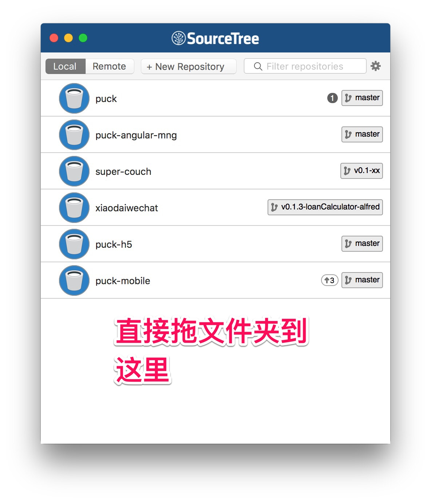
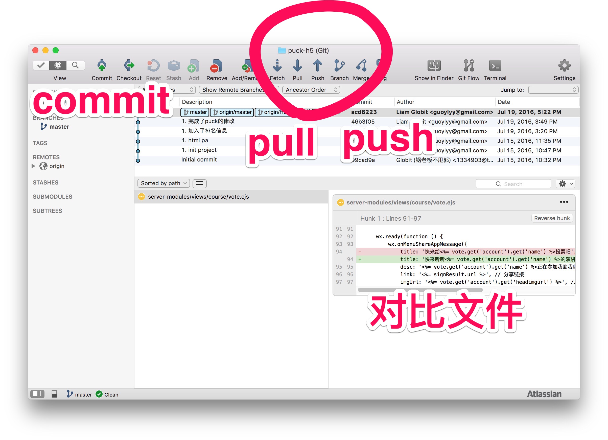
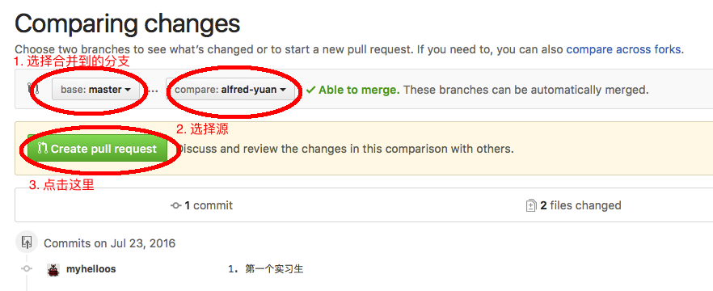

# github 小教程
## git
Git VCS很受开源项目的青睐。它是一个分布式的版本控制系统（DVCS），跟Subversion和很多其他的VCS不同，你不一定非要连接到服务器上。

Git是在2005年发布的，当时是受到了一个叫做BitKeeper的特有VCS的启发。

BitKeeper的发布者授权Linux内核开发团队自由使用该软件，但因为怀疑该团队的成员试图探究BitKeeper的内部工作机制，随后又收回了授权。Linux的缔造者LinusTorvalds，决定创建一个功能相似的VCS，个把月后，Linux内核开发团队用上了Git。

### git安装
#### 1. 安装git命令行
>[命令行安装教程](https://git-scm.com/book/en/v2/Getting-Started-Installing-Git)

#### 2. git常用命令
##### 系统配置
用下面两条命令提供你的姓名和邮箱地址
```
git config --global user.name "Alfred Yuan"

git config --global user.email "yuanxun.cn@gmail.com"
```
##### 初始化项目
```
git init
```
##### 查看当前仓库状态
```
git status
```
##### stage文件
```
git add firstCommit.js
# 表示将firstCommit.js当前的更新置为stage状态
# 替换firstCommit.js为你要添加的文件
```
##### commit
```
git commit -m 'first commit'
# 表示确认当前stage状态下的所有更新，也可以使用`git commit`命令，然后在输入更新消息
# 替换 first commit 为你的commit信息
```
>**commit之前一定要review下自己的代码**

##### push
```
git push remote v0.0.1-firstCommit
# 表示推送当前更新到remote源上的v0.0.1-firstCommit分支上
# remote 为远程分支名称， v0.0.1-firstCommit 为远程分支名
```
##### fetch
```
git fetch remote
# 表示从remote源中获取跟新
```
##### merge
```
git merge remote/v0.0.1-firstCommit
# 合并remote源上的v0.0.1-firstCommit分支的跟新到本地当前分支上
```
##### 新建一个分支
```
git checkout -b v0.1.1-secondCommit
# 表示在当前的分支上新建一个v0.1.1-secondCommit的分支，并切换到该分支

git branch v0.1.1-thirdCommit
# 表示在当前分支上新建一个v0.1.1-thirdCommit的分支

git branch v0.1.1-fourthCommit --track remote/v0.1.1-lastCommit
# 表示在remote/v0.1.1-lastCommit上新建一个新的本地分支，并将remote/v0.1.1-lastCommit作为新分支的上游分支
```
##### 删除分支
```
git branch -d v0.1.1-fourthCommit v0.1.1-thirdCommit
# 删除本地的v0.1.1-fourthCommit和v0.1.1-thirdCommit分支

git branch -D v0.1.1-fourthCommit v0.1.1-thirdCommit
# 强制删除本地的v0.1.1-fourthCommit和v0.1.1-thirdCommit分支
```
#### 3. 安装图形化界面
推荐使用图形化界面，方面**review code**以及**merge 代码**
>[安装图形化界面](https://git-scm.com/downloads/guis)

#### 4. source tree使用教程
1. 添加项目

2. commit，pull, push


>**commit之前一定要review下自己的代码**

## github
GitHub服务提供商提供了Git服务，这是一个强大的版本控制系统（VCS），你还可以通过Web界面轻松浏览Git库。开源项目可以免费使用GitHub。

## Github 教程
### 1. Github注册

### 2. 给Github一个ssh公匙
[按照这里配置好了之后，就不用每次使用命令行都得输入用户名和密码了](https://help.github.com/articles/generating-an-ssh-key/)

### 3. Github协作场景


### 4. Github Pull Request
[官方教程](https://help.github.com/articles/using-pull-requests/)

第一步：新建一个Pr


第二步：选择源分支和你要合并到的分支

**注意：如果有冲突，请先解决冲突**

第三步：写下pr的信息

**注意：如果有冲突，请先解决冲突**


## 任务
去[xiaoguotech-internship](https://github.com/myhelloos/xiaoguotech-internship)项目，新建一个分支，在[self-introduction.md](https://github.com/myhelloos/xiaoguotech-internship/blob/master/self-introduction.md)文件中添加自己的信息并提交一个pr
