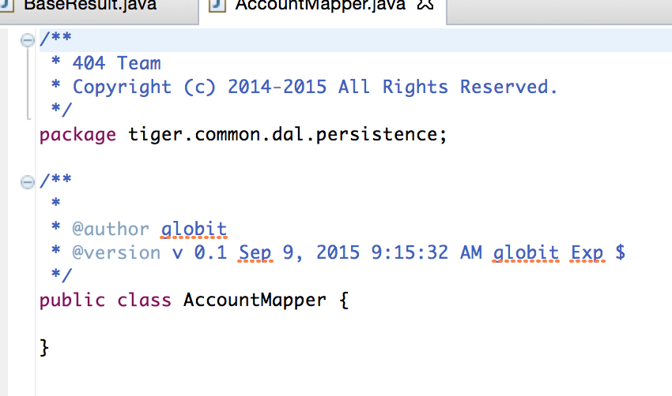
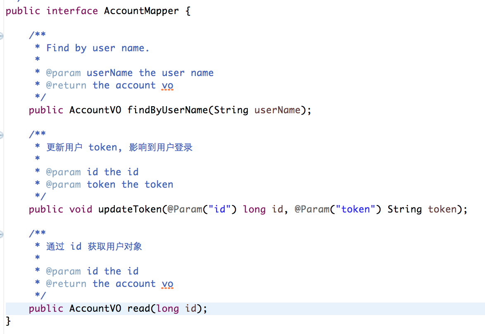
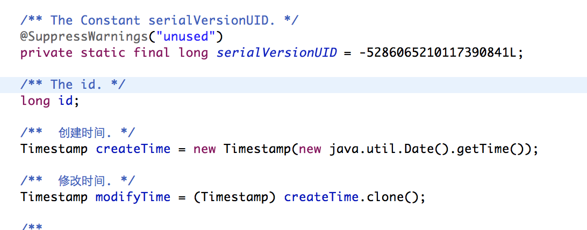
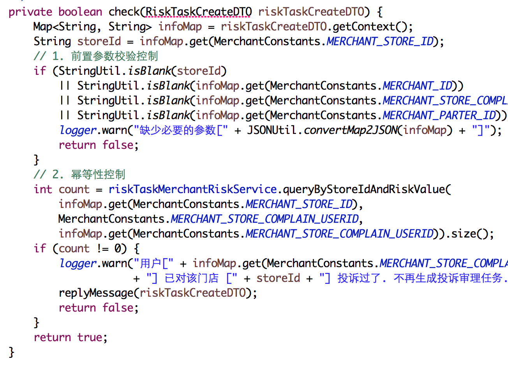
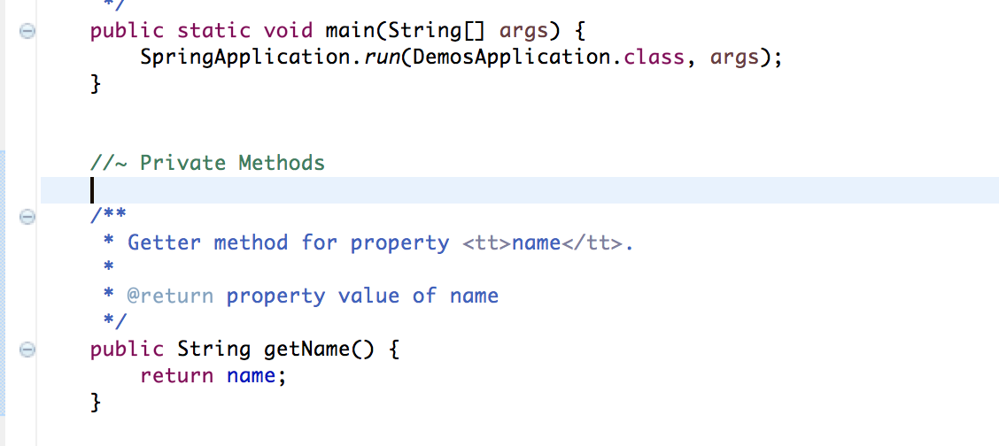
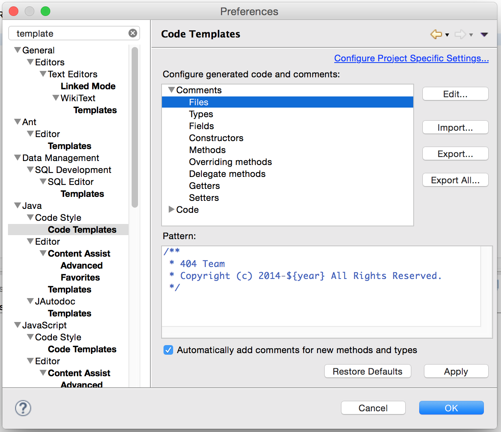
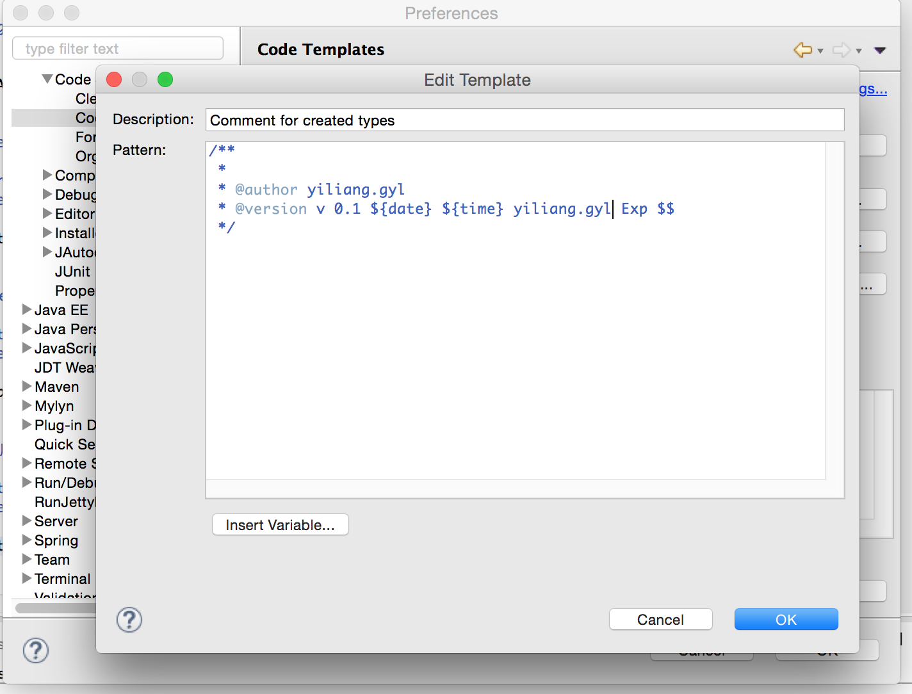
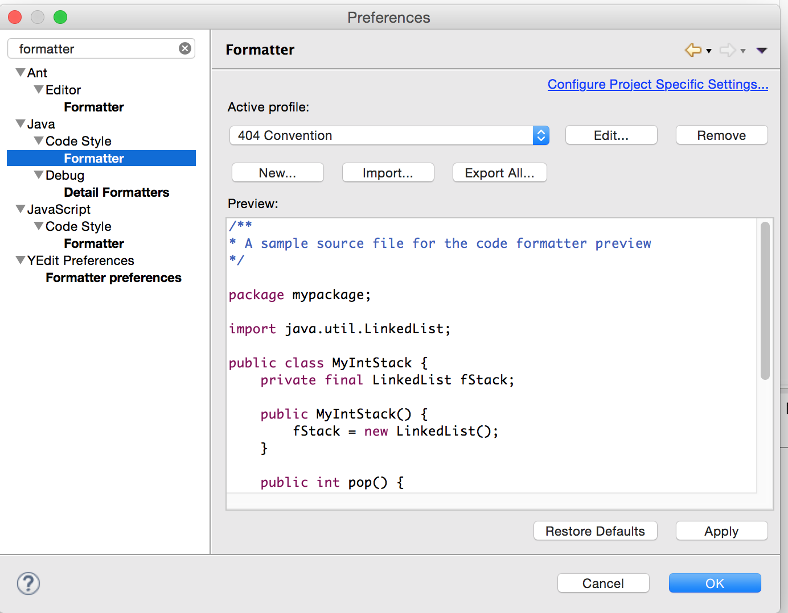
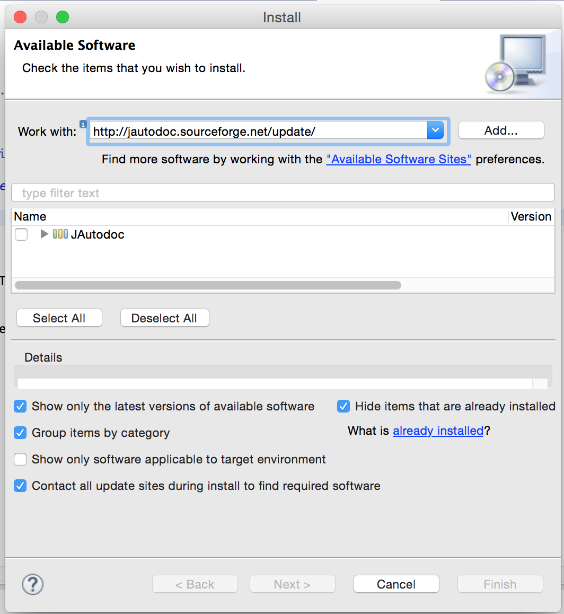

# Java编程风格指南

```
@author: yiliang.gyl
@update: 2015-09-09
```


## 1. 导引

本文概述了 404 团队编写 Java 代码的一些规范。

### 为什么统一风格

* 不吭自己
* 不吭队友


### 使用到的资源

1. **template 文件**
	
	eclipse用于规定生成代码样式的文件
2. **formatter 文件**
	
	eclipse用于规定format 过后的代码风格的文件
3. **JautoDoc插件**

	一键插入所有注释插件
4. **checksyle 插件**

	build 时验证代码风格插件（也有eclipse插件版本）
	
## 2. Java 代码编写规范
	
### 基本要求

* 注释一定要写，具体写多少根据业务来定；
* 如果容易理解的就用 AutoDoc 生成；
* 写注释的时候要有同理心，自己很多年后回来看还看得懂你写了什么。

### Java 文件头部
有 Team 标识 和 头部有更新人等标识:

* 知道这个东西是谁负责的
* 显得更加正规




### 方法头部
方法要让人可以明白:




### 关键变量
关键变量说明什么意思:


### 业务逻辑

* 关键业务逻辑标注执行情况



### 私有方法

* 私有方法单独提出来，文件最后，叠放顺序如下:
	* 私有函数方法（业务类）
	* 私有get set 方法（非业务类）
* 私有方法以以下注释标识




### 如何生成标准注释？

#### 导入 template 文件

[下载地址](src/404codetemplates.xml)


设置自己的名字:



### 导入 formatter 文件

[下载地址](src/404codeFormatter.xml)





## 3. 插件 


### AutoDoc 的安装和使用

**Url地址:** http://jautodoc.sourceforge.net/update/

**安装方法:** 进入 eclipse Help/Install New Software, 复制以上地址，一路下一步安装



#### 快捷键

Mac: alt + control + J (把光标移动到类名上面按下，会有惊喜额）

#### 修改生成的注释

原则:

* 一些显而易见的方法如 getter setter 可以直接用生成英文注释
* 一些关键方法必须用中文注释
* 关键变量必须用中文注释


### checkStyle 插件的使用

* 每次提交代码的时候要build，查看是否有未处理的 checkStyle 问题
* 每周会集中处理

....待更新....


	
	